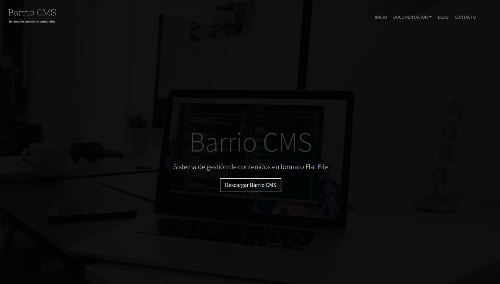

# This repository is no longer maintained check [cmsbarrio](https://github.com/monchovarela/cmsbarrio)





### Requisitos

**PHP 5.3** minimo con **PHP's Multibyte String module**

**Apache** con **Mod Rewrite**


### Instalación

**Muy facil** solo tienen que copiar la carpeta del **CMS** en su Hosting y cambiar algunos parametros en el archivo ```config.php``` y en el ```.htaccess```


**Archivo config.php**


    <?php

    return array(
        'lang' => 'es',
        // charset
        'charset' => 'UTF-8',
        // timezone
        'timezone' => 'Europe/Brussels',
        // plantilla por defecto
        'theme' => 'default',
        // titulo de la web
        'title' => 'Barrio CMS',
        // descripcion de la web
        'description' => 'Sistema de control de contenidos en formato Flat File',
        // palabras clave
        'keywords' => 'cms,barrio,flatfile',
        // autor
        'author' => 'Moncho Varela',
        // correo
        'email' => 'demo@gmail.com',
        // imagen por defecto
        'image' => 'content/imagenes/sin-imagen.svg',
        // blog
        'blog' => array(
            // blog image
            'image' => 'content/imagenes/sin-imagen.svg',
            // Blog titulo
            'title' => 'Chuck Gomez',
             // Blog descripcción
            'description' => 'Desarrollador y Diseñador Web. Aprendiendo y mejorando cada día.',
            // Buscador titulo
            'search_title' => 'Buscar Pagina',
            // Buscador boton
            'search_btn' => 'Buscar',
            // Articulos recientes
            'recent_posts' => 'Articulos recientes'
        ),
        // navegacion
        'menu' => array(
            '/' => 'Inicio',
            '/acerca-de' => 'Acerca De',
            '/blog' => 'Blog',
            '/contacto' => 'Contacto'
        ),
        // buscador
        'search' =>  array(
            'results_of' => 'Resultados de la busqueda',
            'no_results' => 'No hay resultados',
            'read'       => 'Ir a enlace'
        ),
        // copyright
        'copyright' => 'Creado con Barrio CMS',

        // social
        'facebook' => 'https://facebook.com',
        'instagram' => 'https://instagram.com',
        'twitter' => 'https://twitter.com',
        'youtube' => 'https://youtube.com'

        // añadir mas si se quiere aqui...
    );


**Archivo .htaccess**

Si esta dentro de una carpeta poner el nombre de ella

**Por ejemplo:**

    # PHP 5, Apache 1 and 2.
    <IfModule mod_php5.c>
      php_flag magic_quotes_gpc                 off
      php_flag magic_quotes_sybase              off
      php_flag register_globals                 off
    </IfModule>

    <IfModule mod_rewrite.c>
        RewriteEngine On
        # Si esta en un directorio añadirlo
        RewriteBase /misitio
        Options +FollowSymlinks
        RewriteRule ^content/(.*)\.(txt|md|yml|json)$ index.php [L]
        RewriteCond %{REQUEST_FILENAME} !-f
        RewriteCond %{REQUEST_FILENAME} !-d
        RewriteRule ^(.*)$ index.php?$1 [L,QSA]
    </IfModule>


    <IfModule mod_autoindex.c>
        Options -Indexes
    </IfModule>


### Variables Plantilla


    {date} = fecha d-m-Y

    {Year} = Año
 
    {Site_url} = Url base

    {Site_current}  = hash
    
    {* comment *} = Comentario

    {Last_posts}  = Ultimos articulos

    {Blog_posts} = Articulos

    {Pages: demo} = Paginación de otra carpeta

    // If else
    {If: $Segment == '/'}
        Estas en el inicio
    {Elseif: $Segment == '/blog'}
        Estas en el blog
    {Else}
        Estas en otro lado
    {/If}

    // comprueba el hash de ese momento
    {Segment:  '/'}
        Estas en el inicio
    {/Segment}
    
    // loop
    {Loop: $confit.blog as $item}
        {$item.title}
    {/Loop}

    // loop key => value
    {Loop: $confit.blog as $k=>$v}
        {$k} = {$v}
    {/Loop}

    // icual que echo 'hola'
    {?= 'hola' ?}

    // codifica en Base uri
    {$page.slug|encode}

    // decodifica en Base uri
    {$page.slug|decode}

    // capitaliza
    {$page.slug|capitalize}

    // codifica en md5
    {$page.slug|md5}

    / codifica en sha1
    {$page.slug|sha1}

    // htmlspecialchars
    {$page.content|e}

    // html_entity_decode
    {$page.content|parse}

    // llamar una acción
    {Action: navigation}

    // include once
    {Include: themes/default/inc/header.inc.html}

    // include once en la carpeta de la plantilla actual
    {Partial: inc/header.inc.html}
    
    // carpeta assets
    {Assets: img/logo.svg}

### Crear una Plantilla


    {* incluimos las partes *}
    {Partial: inc/head.inc.html}
    {Partial: inc/header.inc.html}
    <div class="container">
        <div class="row">
            <div class="col-md-6 m-auto">
                {* Action puede ser necesario para algunos plugins *}
                {Action: theme_before}
                {* variables $page *}
                <h3>{$page.title}</h3>
                <p>{$page.description}</p>
                {$page.content}
                {Action: theme_theme_after}
            </div>
        </div>
    </div>
    {Partial: inc/prefooter.inc.html}
    {Partial: inc/footer.inc.html}

En el archivo config tambien podemos crear contenido estatico y llamarlo con la variable `{$config}`.
Por ejemplo podemos crear un array con algunos links por ejemplo:

    'links' => array(
        'uno' = 'url',
        'dos' = 'url',
        'tres' = 'url',
    )

Ahora solo tenemos que usar `{$config.links.uno}` o `{$config.links.dos`


## Shortcodes plantilla md


Una de las mejores formas a mi a parecer de junto a **Markdown** hacen que sea mas facil editar una pagina.


### Url (Url del sitio)

    {Url}


### Email (Email de config.php)

    {Email} 


### More ( el excerpt de Wordpress )

    {More} 


### Iframes


**Nota:** Solo acepta contenido seguro `https`


    // src = enlace del iframe
    // cls = clase css
    {Iframe  src='monchovarela.es'}


### Youtube & Vimeo


    // id = id del video
    // cls = clase css
    {Youtube id='GxEc46k46gg'}


    // id = id del video
    // cls = clase css
    {Vimeo id='149129821'}


###  Texto


    // bg = Color del fondo
    // Color = Color del texto
    {Texto bg='blue' Color='white'}
    Lorem ipsum dolor sit amet, consectetur adipisicing elit. Quo necessitatibus, provident maiores vero dolorum saepe architecto quam rerum possimus assumenda, incidunt sit quis, qui at dolor minima dicta aperiam fuga.
    {/Texto}


###  Alerts


    // type [primary|secondary|success|info|warning|danger|light|dark]
    {Alert type='primary'}**Primary!** This is a primary alert-check it out!{/Alert}
    {Alert type='secondary'}**Secondary!** This is a primary alert-check it out!{/Alert}
    {Alert type='success'}**Success!** This is a primary alert-check it out!{/Alert}
    {Alert type='info'}**Info!** This is a primary alert-check it out!{/Alert}
    {Alert type='warning'}**Warning!** This is a primary alert-check it out!{/Alert}
    {Alert type='danger'}**Danger!** This is a primary alert-check it out!{/Alert}
    {Alert type='light'}**Light!** This is a primary alert-check it out!{/Alert}
    {Alert type='dark'}**Dark!** This is a primary alert-check it out!{/Alert}


###  Botones


    // Color = [primary|secondary|success|info|warning|danger|light|dark|link]
    // text = texto del boton
    // id =  id del boton (opcional)
    // link = dirección  (opcional)

    {Btn Color='primary' text='Primary' link='http://example.com'}
    {Btn Color='secondary' text='Secondary' link='http://example.com'}
    {Btn Color='success' text='Success' link='http://example.com'}
    {Btn Color='info' text='Info' link='http://example.com'}
    {Btn Color='warning' text='Warning' link='http://example.com'}
    {Btn Color='danger' text='Danger' link='http://example.com'}
    {Btn Color='light' text='Light' link='http://example.com'}
    {Btn Color='dark' text='Dark' link='http://example.com'}
    {Btn Color='link' text='Link' link='http://example.com'}


###  Columnas

    // cls = se le puede añadir cualquer clase
    {Row}

    // num = numero de Columnas que al sumarse sean igual a 12
    {Col num='4'}
    Labore ipsum ea dolor labore deserunt magna magna sit consequat magna eiusmod consequat.
    {/Col}

    {Col num='4'}
    Labore ipsum ea dolor labore deserunt magna magna sit consequat magna eiusmod consequat.
    {/Col}

    {Col num='4'}
    Labore ipsum ea dolor labore deserunt magna magna sit consequat magna eiusmod consequat.
    {/Col}

    {/Row}


### Barra de progreso

    // size = Tamaño de la barra
    // Color = [success | info | warning | danger ]
    // cls = otra clase
    {Progress  size='25' Color='success'}
    {Progress  size='30' Color='info'}
    {Progress  size='40' Color='warning'}
    {Progress  size='60' Color='danger' cls='mb-5'}


###  Cards

    // Row para agrupar
    // Col = numero de Columna que sume 12 en total en el Bloque
    // title =  titulo
    // img = imagen
    // cls = css class
    {Row}
    {Card num='4' title='heart' img='{url}/content/imagenes/sin-imagen.svg'}
    Row que sumen 12 en total

    {Btn Color='primary' text='Primary' id='btn' link='//example.com'}
    {/Card}
    { Card num='4' title='heart' img='{url}/content/imagenes/sin-imagen.svg'}
    Row que sumen 12 en total

    {Btn Color='primary' text='Primary' id='btn' link='//example.com'}
    {/Card}
    { Card num='4' title='heart' img='{url}/content/imagenes/sin-imagen.svg'}
    Row que sumen 12 en total

    {Btn Color='primary' text='Primary' id='btn' link='//example.com'}
    {/Card}
    {/Row}


###  Accordions

    // id = id del acordeon
    {Accordions id='acordeon'}

    // title = el titulo
    // cls = la clase ( si es active el acordeon se expande)
    {Accordion cls='active' title='Acordeon uno'}
    Lorem ipsum dolor sit amet, consectetur adipisicing elit. Possimus sit similique quidem, sint veniam amet nostrum facilis eius consectetur. Doloremque fuga, libero veritatis itaque nisi numquam earum. Ipsum explicabo, quasi.
    {/Accordion}

    {Accordion  title='Acordeon dos'}
    Lorem ipsum dolor sit amet, consectetur adipisicing elit. Hic quam quasi, officia nulla est possimus fugit nesciunt, dolores dolore eaque. Consequatur, ipsa. Voluptas, laborum voluptatum aliquid doloribus quos praesentium quod.
    {/Accordion}

    { Acordeon  title='Acordeon tres'}
    Lorem ipsum dolor sit amet, consectetur adipisicing elit. Vero aperiam nemo adipisci cumque qui vitae nihil. Consequatur quo explicabo dolore quas, autem, temporibus repellendus nostrum qui in necessitatibus optio, non.
    {/Accordion}

    {/Accordions}


###  Iconos

    // type = nombre
    // href = enlace
    // cls = clase css
    {Icon type='facebook' href='//facebbok.com'}


